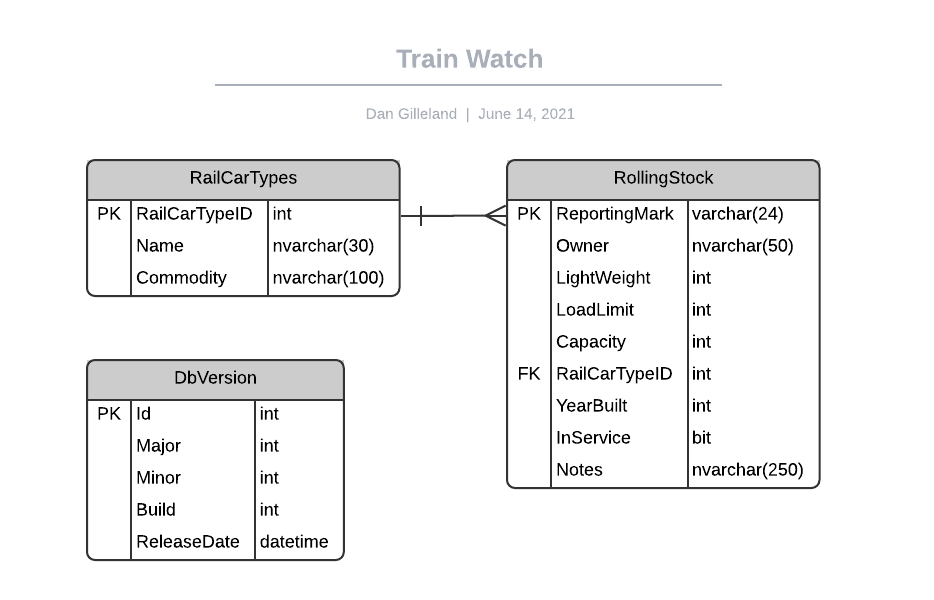

# Train Watch - Ex05 - Database Querying Based on Filters

> This is the **third** in a series of exercises where you will be building a website to manage information on trains. **Train Watch** is a community site for train lovers who want to keep up-to-date on trains across North America. They want to maintain a database of Engines and RailCars.
>
> **This set is cumulative**; future exercises in this series will build upon previous exercises.

## Overview

A key aspect of the site is to allow users to search the database to find information on various rail cars. Your task in this assignment is to provide that functionality.

Use the demos presented in class as a guide to implementing this exercise.

### Create Query Page

Create an `Query.cshtml`/`Query.cshtml.cs` Razor Page. The Page Model class must declare in its constructor a dependency on the `RollingStockServices` and `TrainWatchServices` classes.
Be sure to add a menu item so that this page can be navigated to using the main menu; use the text **Query** for the link.

### Query Page to Search Rolling Stock

The `Query` page will display summary information on the rolling stock data in an HTML table with. Display the `ReportingMark`, `Owner`, `Capacity` and `InService` information. This query page will have two filters: Partial Search String and Drop Down List. The return query data will be of the same layout from both queries. Each filter will have a `search` button requiring a page handler. Also have a `clear` button to reset the page to an empty state.

#### Partial Search String Filter

Allow the user to enter a partial search string to filter on any portion of the reporting mark data value (e.g.: "BN" or "50"). Present all of the records that have any of the partial data in the reporting mark as a table.

Search Query: RollingStockServices

`_context.RollingStocks.Where(x => x.ReportingMark.Contains(searcharg)`

#### Drop Down List Filter

Allow the user to pick a car type from a dropdown menu, and retrieve all of the cars of that type. Present all of the records of that car type in a table.

Search Query: RollingStockServices

`_context.RollingStocks.Where(x => x.RailCarTypeID == searcharg)`

List Query: TrainWatchServices

`_context.RailCarTypes.OrderBy(x => x.Name)`

Only present the data as shown below:

| Reporting Mark | Owner               | Capacity | InService |
|----------------|---------------------|----------|-----------|
| BN 19117       | Burlington Northern | 192200   | True
| BN 95782       | Burlington Northern | 192200   | True
| BN 95831       | Burlington Northern | 192200   | True
| BN 95887       | Burlington Northern | 192200   | True
| BN 95914       | Burlington Northern | 192200   | True

In order to get all of this to work you have to create two new entity classes `RailCarType.cs` and `RollingStock.cs` (Entities), update the `TrainWatchContext.cs` (DAL), add a new services (list query) to `TrainWatchServices.cs` (BLL) and create a new services class `RollingStockServices` (BLL) containing the two search queries. You will need to register your `RollingStockServices`.
Use the demos presented in class as a guide to achieving this. Get this part to work before moving on.

To ensure that your web application works, build and run your project.

